# Criando a infraestrutura do projeto usando o Oracle Resource Manager.

This lab will walk you through the creation of the Workshop infraestructure, for that we will use [Oracle Resource Manager]()
Oracle Resource Manager is a free tool that uses terraform files to manage resources inside a Oracle Cloud tenancy.

* To know more about Oracle Resource Manager access [here]().
* To know more about Oracle Cloud Infraestructure Terraform provider access [here]().

## Managing your infraestructure using Oracle Resource Manager

On the top left corner click on the hamburguer menu, and access Resource Manager > Stacks

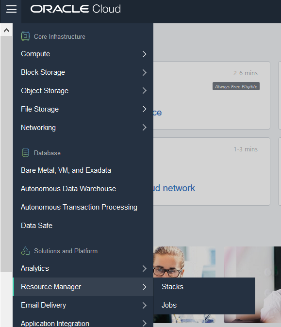

Click on create a stack

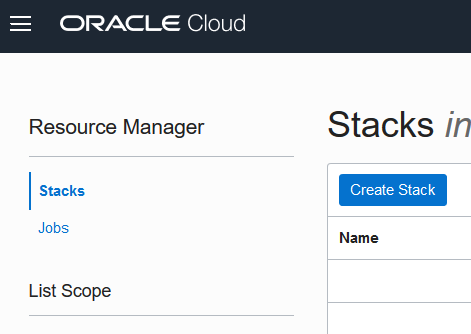

Drag and drop the terraform.zip file found inside the terraform folder of the forked project (./terraform/terraform.zip) this file containsa set of terraform scripts meant to create the workshop infraestructure please review those files to understand how the infraestructure is created, and what assets are being modified in your tenancy.

Give a name, and a description to your stack and click next.

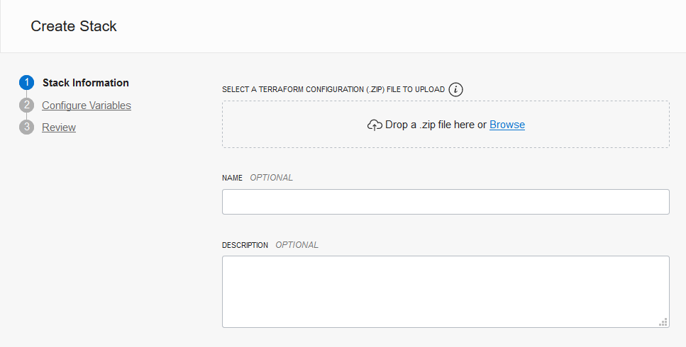

Insert your user OCID that was collected on the Lab040

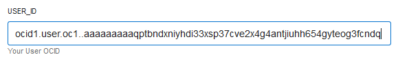

Change the number of Availability Domains accordingly to your tenancy home region quantity, please refer to [this page](https://docs.cloud.oracle.com/iaas/Content/General/Concepts/regions.htm) to know about this information.

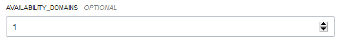

Insert a password for your Oracle Autonomous Database

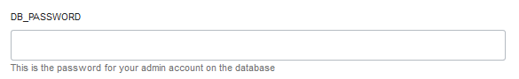

Review the information, and click in Create

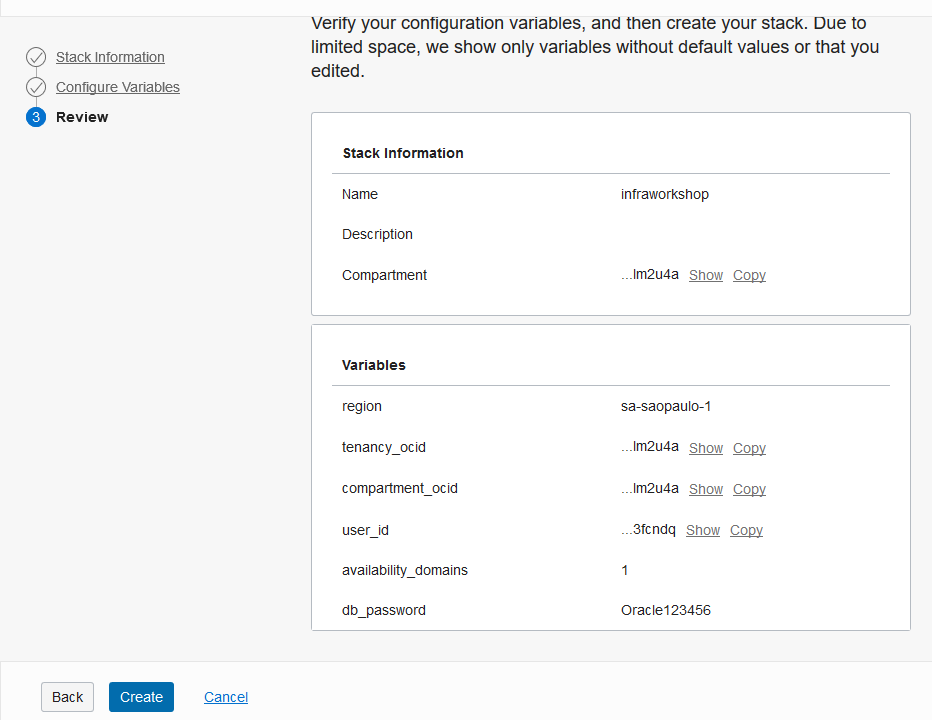

On the newly created stack page, click on Terraform Actions > Plan

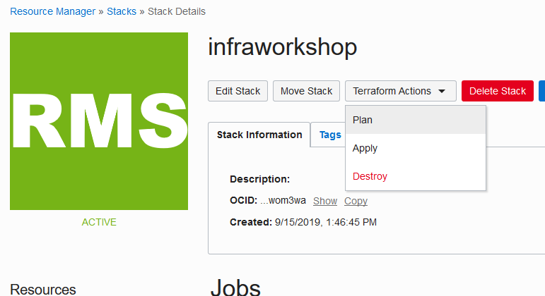

On the Job Planning page, click on Plan

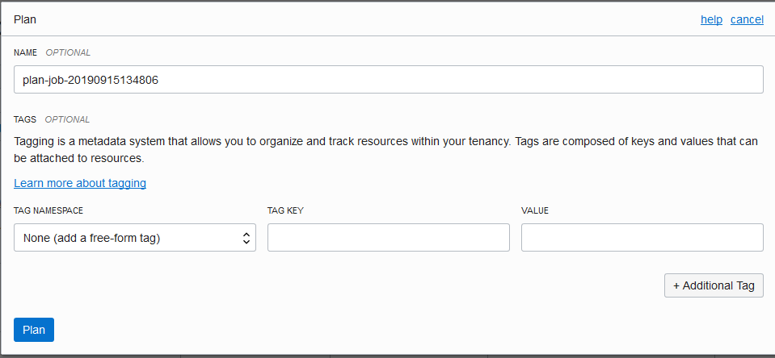

Wait until the job is done, if it returns an Failed please review the log to see what happened.

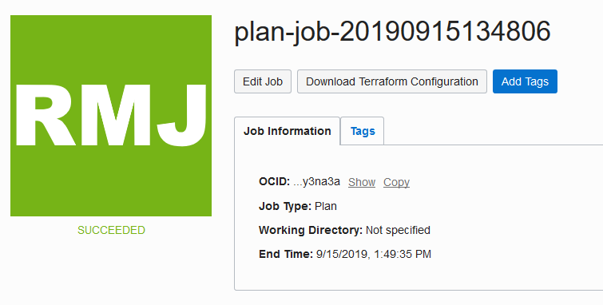

Return to the stack page, click on Terraform Actions > Apply

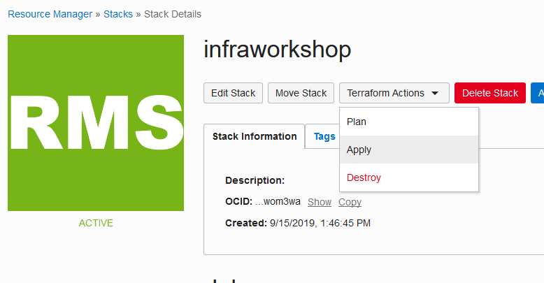

On the Job applying page, click on Apply


```diff
-This process may take several minutes-
```

Wait until the job is done, if it returns an Failed please review the log to see what happened.