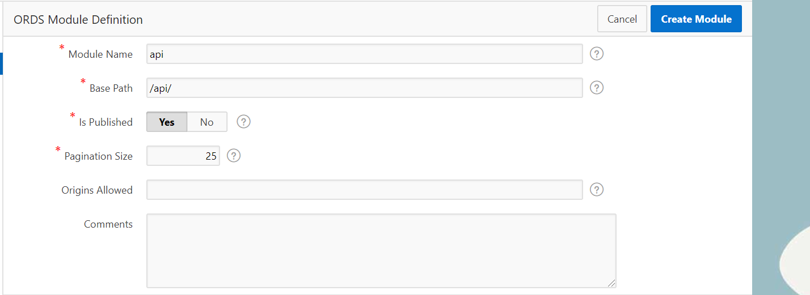

## Configuring Oracle Autonomous Database and the Oracle Rest Data Service

In this Lab we are going to configure our instance of the Oracle Autonomous Database, for that we are going to use the APEX service to import a dataset to our database, and use ORDS to create an API to fetch data from our database.

## Configuring the Oracle Autonomous Database APEX Service

Access the path Menu > Oracle Autonomous Transaction Processing

Make sure that you are on the right compartment, and click on your instance of the Oracle Autonomous Database

Click on Service Console

On the Service Console click on Development

Select Oracle Application Express to launch the APEX console

Login on the console using your DB administrator password

Click on create a new Workspace

Fill the form with the following information, and click Create:

- Database User: ORDS
- Password: < DB Password >
- Workspace Name: ORDS

Sing out of the console on the top right corner, and click on Return to Sing In

Now sign in in your newly created Workspace

On the main page, click on App Builder > Create

Click on From a File option

Drag n drop the users.csv file found in this folder

Scroll down and then fill the form with the following information and click in Load Data

- Table Owner: ORDS
- Table Name: USERS
- Error Table Name: USERS_ERR$

Close the Wizard window

On the top bar click on SQLWorkshop

Click on RESTful Services

Click on Register a Schema With ORDS

Change the Install Sample Service to NO, and click Save Schema Attributes

On the left corner click on Modules to create our endpoint

Click on Create Module

Fill accordingly to the image bellow, and click in Create Module

On the bottom right corner, click on Create Template

Define a name to you URI and click on Create Template

On the bottom right corner, click on Create Handler to create our endpoint

Fill the form using the information bellow

- Method: GET
- Source Type: Query
- Source: select * from users where id = :id

At the bottow of the page we will set the URI parameters, to that click on Add Row and fill with the following information

At the top of the page, click on Create Handler

Now you can copy the URI and add the id parameter like this exemple to test if its working on your Browser

< URL >/ords/ords/api/users/?id=1

Copy the Full URL to a notepad, we will be using this information in the following labs

Now you may proceed to the next lab.