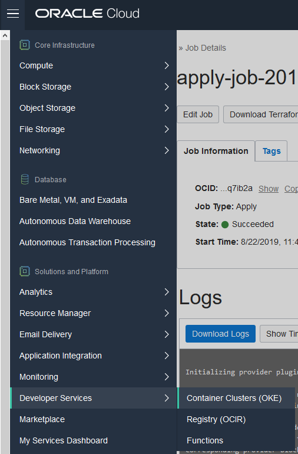
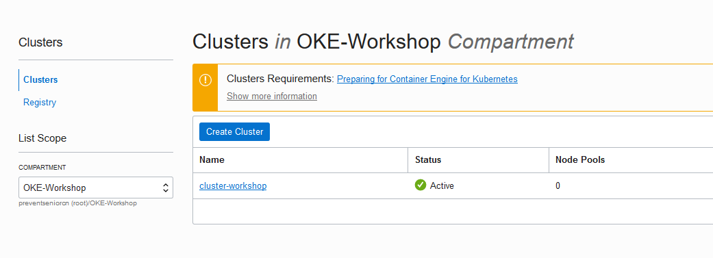
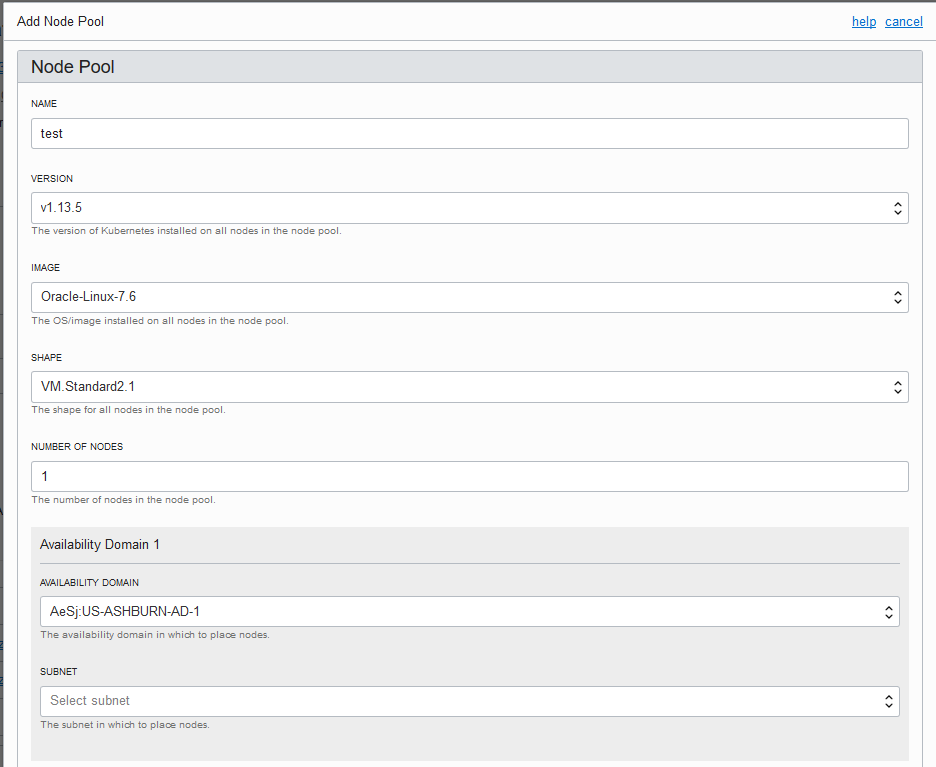
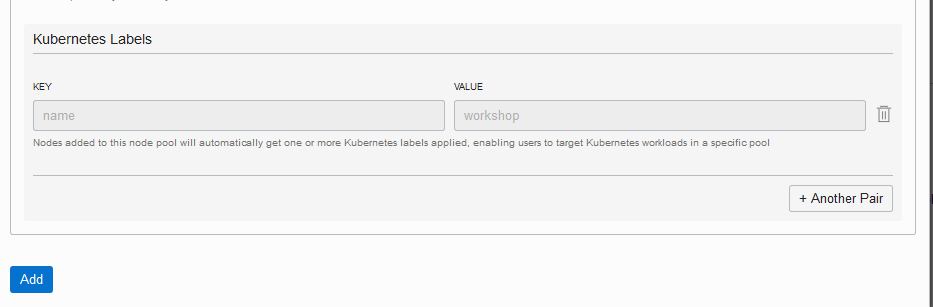
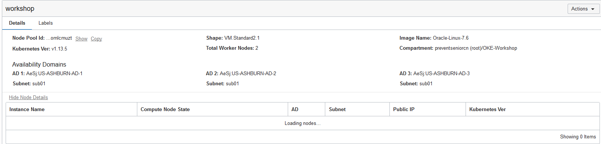
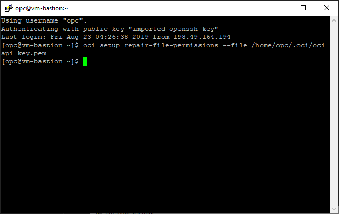
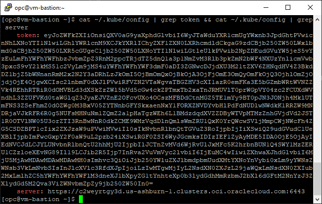
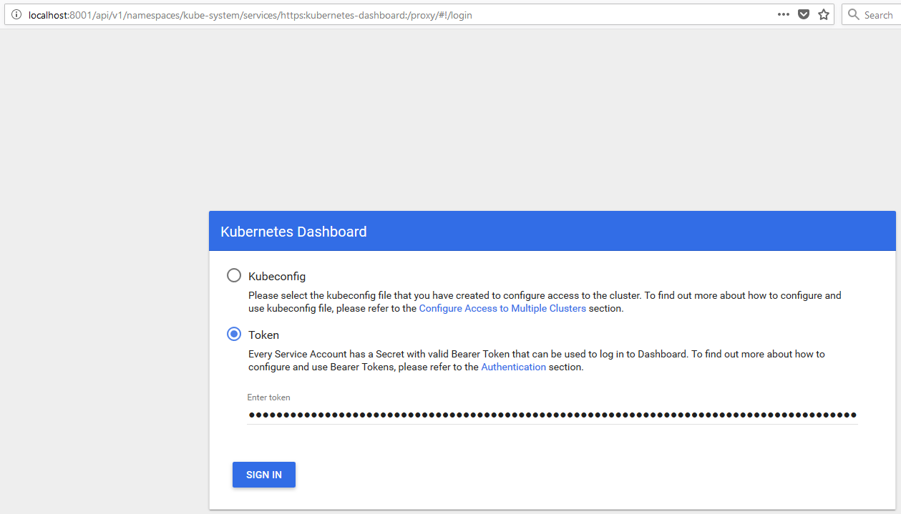
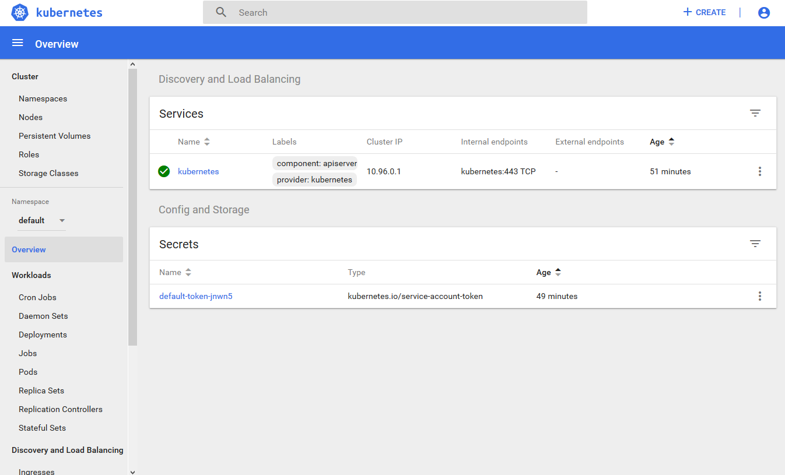

## Configuring the Node pool
In this step we will be configuring the node pool for the OKE cluster created on the previous lab

Access Menu > Developer Services > Container Cluster OKE

Select the compartment OKE-Workshop, and access your cluster

At the bottom of the page, on the Node pool section click on Add Node Pool

Fill the form accordingly to this guide:

- Name: name of your node pool
- Version: 1.13.5
- Image: Oracle Linux 7.6
- Number of nodes: 1 per Availability Domain (Please refer to [this]() document to see how many availability zones are in your tenancy region)
- Availability Domain:1 per Availability Domain (Please refer to [this]() document to see how many availability zones are in your tenancy region)
- Subnet: sub1 (in every Availability Domain created)

Click in Add

Wait until the completion

## Configuring the Bastion Host VM for your OKE Cluster

You will need to connect to your VM and configure the access to your specifc cluster. You will have to tunnel your remote Bastion Host VM and your local machine at port 8001 to manage from localhost your Kubernetes Dashboard.

So, let's do it!

### For Linux/MacOS environments

Open the terminal and type:

    ssh opc@'your_remote_bastion_ip_address' -i 'your_oci_api_key_local_path'/oci_api_key.pem -L 8001:localhost:8001

### For Windows environments

Here you have 2 options:

* Windows PowerShell:

Open the PowerShell terminal and type:

    ssh opc@'your_remote_bastion_ip_address' -i 'your_oci_api_key_local_path'/oci_api_key.pem -L 8001:localhost:8001

* Windows PuTTY:
  * Session
    * Host Name (or IP Address): 'your_remote_bastion_ip_address'
  * Connection
    * Data
      * Auto-login username: opc
  * Connection
    * SSH
      * Auth
        * Private key file for authentication: 'your_oci_api_key_local_path'/oci_api_key.ppk
  * Connection
    * SSH
      * Tunnels
        * Source port: 8001
        * Destination: localhost:8001
        * Click the **Add** button
  * Session
    * Saved Sessions: OKE Workshop
  * Click the **Save** button
  * Click the **Open** button

After you connect to your Bastion Host VM, run the following commands:

    oci setup repair-file-permissions --file /home/opc/.oci/oci_api_key.pem

Now you are ready to run the commands of the "Getting Started" session of the Cluster Details page and, after that, run the following commands

    cat ~/.kube/config | grep token && cat ~/.kube/config | grep server
    kubectl proxy

and access the Kubernetes from your local browser through the localhost address:

<http://localhost:8001/api/v1/namespaces/kube-system/services/https:kubernetes-dashboard:/proxy/>

You must select the Token option and paste the token you can get from the shell terminal.

You are logged in the Kubernetes Dashboard!

Now you can much easily follow the steps of [Container Native Development Workshop](https://oracle.github.io/learning-library/workshops/container-native-development/?version=Virtual+Box&page=LabGuide100.md) that is partially translated (with some more explanations) on [this manual](https://www.manula.com/manuals/hoshikawa-cristiano/devops-containers/1/pt/topic/devops-com-oracle-container-pipelines)
