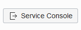
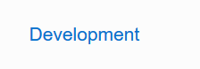
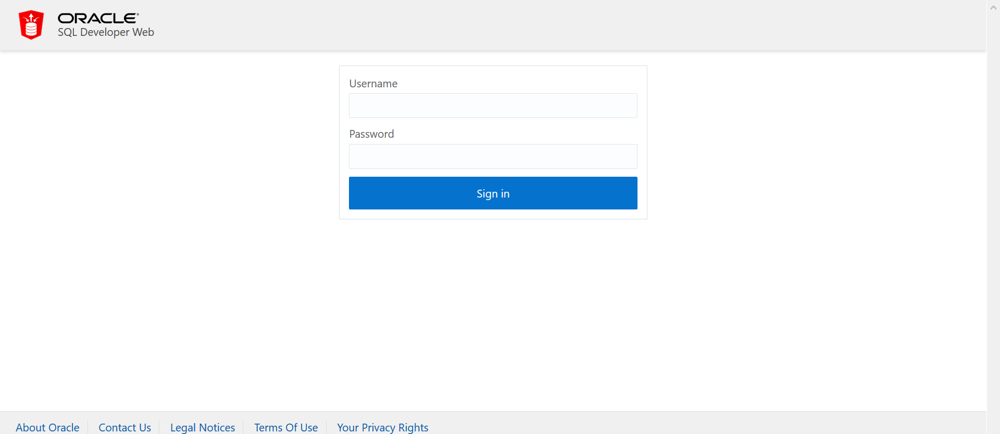
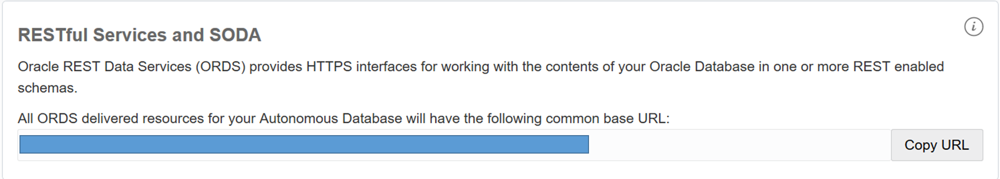

## Quick guide on how to use Oracle Rest Data Service noSQL features (SODA)
This lab will walk you through the configuration of the RESTful Services and SODA feature. Oracle REST Data Services (ORDS) provides HTTPS interfaces for working with the contents of your Oracle Database in one or more REST enabled schemas.

Access your database console by clicking on Service Console:



Click on Development on the left menu:



Click on SQL Developer Web link and log in with the ADMIN user.



Enable admin schema to accept json requests for the ADMIN user by running the following scrip on the worksheet session:

```
EXEC ords.enable_schema;
 GRANT SODA_APP TO admin;
 BEGIN
   ords.delete_privilege_mapping(
     'oracle.soda.privilege.developer',
     '/soda/*');
   COMMIT;
 END;
```
```diff
-It's not a good practice to use the admin user, please refer to this guide to create a new user/schema and enable it to use SODA/ORDS: https://docs.oracle.com/cd/E56351_01/doc.30/e58123/rest.htm#ADRST107-
```
Return to the service console and copy the RESTful Services and SODA URL:



###### The next steps will use CURL as main tool of calling the Rest Data Services, please feel free to use any tool of your preference.

Create a new Collection [PUT]:
Execute the following command in the command line to create a collection to store json data:

```
curl -X PUT -u 'admin:<YOUR DB PASSWORD>' "<ORDS URI>/admin/soda/latest/<COLLECTION NAME>"
```

Create a new object [POST]:
Execute the following command to insert a new object

```
curl -X POST -u 'ADMIN:<YOURPASSWORD>' -H "Content-Type: application/json" --data  '<YOUR JSON INPUT>' "<ORDS URI>/admin/soda/latest/<COLLECTION NAME>"
```

List all objects [GET]:
Execute the following command to list all objects:

```
curl -X GET -u  'ADMIN:<YOUR DB PASSWORD>'  "<ORDS URI>/admin/soda/latest/<COLLECTION NAME>"
```

List a specific object [POST + command --data-binary]:
Execute the following commando to list a single object:

```
curl -X POST -u 'admin:<YOURPASSWORD>' --data-binary '<FILTER PARAMETERS IN JSON FORMAT>' -H "Content-Type: application/json" "<ORDS URI>/admin/soda/latest/custom-actions/query/<COLLECTION NAME>/"
```

For more information access: https://docs.oracle.com/en/database/oracle/oracle-rest-data-services/18.2/adrst/soda-rest-http-operations.html#GUID-76719CE0-8BBE-4AF8-A34B-F7A9FF8811BD
