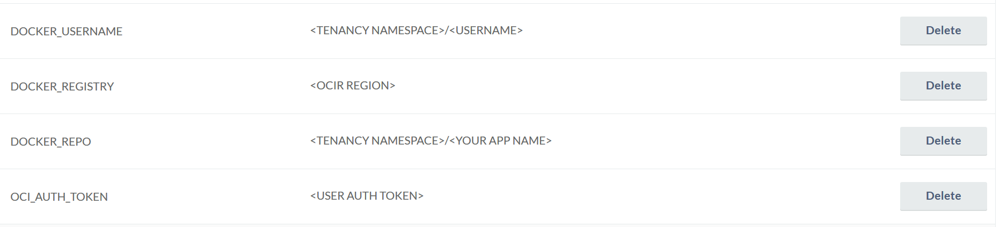
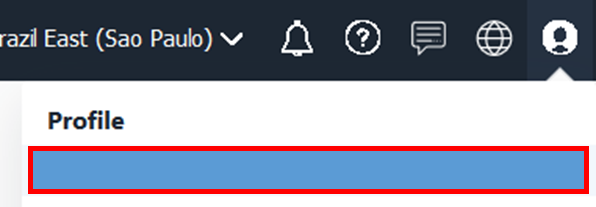

## Create a new application and contenerize it using Oracle Container Pipelines (Wercker).

Log in your [github](https://github.com/login) account 

Access the following project: https://github.com/gustavogaspar/cloudnativeapp

On the top right corner, click on fork icon, to fork this repository to your git.


Access the Oracle Container Pipelines site https://app.wercker.com, and click on login with Github


On the main page, click on Create your first application link


Select GitHub as your SCM and click next


Search for your newly forked app by the name of "cloudnativeapp" and click next

Select "wercker will check out the code without using an SSH key" and click next


Review the information and click in Create


Back to the github page, in the newly forked repository, click on create a new file and name it wercker.yml


*NOTE*: Wercker configuration file is written in YAML, a structured, text-based language which is often used for configuration files. If you are not familiar with YAML, see YAML syntax (http://devcenter.wercker.com/docs/wercker-yml/yaml-syntax), or the official YAML reference card (http://www.yaml.org/refcard.html).

In the next steps we are going to configure a wercker.yml file from scratch, every step bellow demands that you paste informations into the wercker.yml file and commit it.

Wercker is a tool that is integrated with your github, so every commit that you make will trigger the application workflow.


### Building our application steps
1. Build:
The build step is responsible for creating the container image for your application, copy the code bellow and add it to your wercker.yml file

```
box: 
# The image that is going to be used as base image for our application
  id: node:latest
    
build:
  steps:
# The code bellow is about getting our application nodejs dependencies installed on our container.
# To see the references for other languages, please refer to: https://devcenter.wercker.com/quickstarts/languages/
    - npm-install
    - npm-test
    - script:
        name: echo nodejs information
        # Here we are declaring an environment variable to use it latter in our application
        code: |
          export DBURI=$DBURI
          echo $DBURI
          echo "node version $(node -v) running"
          echo "npm version $(npm -v) running"
```

Now get back to the Wercker page and access the Envionment tab, to set our DBURI variable and click in Add:


To test our first step return to the Runs tab and click on "trigger the build now" link:


2. Push:

The push step is responsible to push our newly created image to Oracle Container Image Registy. Copy the code bellow and paste it on our wercker.yml file.
```diff
-Please respect the spaces, yaml is a language based on identation- 
```
```
push:
  steps:
    - internal/docker-push:
            entrypoint: node index.js
            working-dir: $WERCKER_ROOT
            tag: $WERCKER_GIT_COMMIT
            ports: "80"
            username: $DOCKER_USERNAME
            password: $OCI_AUTH_TOKEN
            repository: $DOCKER_REGISTRY/$DOCKER_REPO
```

Now back to the wercker console, click on the environment tab and add the following environment variables:



Fill the value fields accordingly with your tenancy information. Follow the guide bellow to get the informations that you need on this step:

#### <TENANCY NAMESPACE>

On the oci console click on your profile icon on the top right corner, and than click on your tenancy name:


Copy the Storage Name Space Information


#### <USERNAME>

On the oci console click on your profile icon on the top right corner, and than click on your username



Copy the whole path of your user name:


#### <OCI AUTH TOKEN>

On the oci console click on your profile icon on the top right corner, and than click on your username


On the bottom left corner click on Auth Tokens and generate a new token, copy the information


#### <OCIR REGION>

Please insert the information accordingly to your region code: https://docs.cloud.oracle.com/iaas/Content/Registry/Concepts/registryprerequisites.htm#Availab
```
<region-code>.ocir.io
```

Back to the wercker console, on the Workflows tab, scroll down and click on add new pipeline


Fill the form with the following information:

* Name: push
* YML Pipeline name: push
* Hook type: Default


Click again on the  Workflows tab, click on the plus sign right to the build icon and select the newly created pipeline


Verify that the flow was updated


Test your new flow by clicking on the Runs Tab, click on any buid that has been made until now.


Click on the actios button, and than click on execute this pipeline again


Add a description and click on Execute Pipeline.


criar arquivo wercker (trocar var env)
criar build no yml
criar push-release no yml (atentar para namespace)
criar


