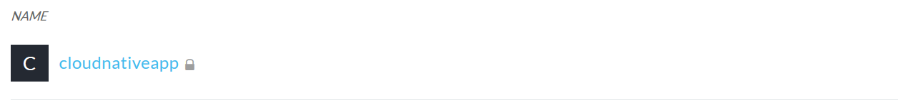
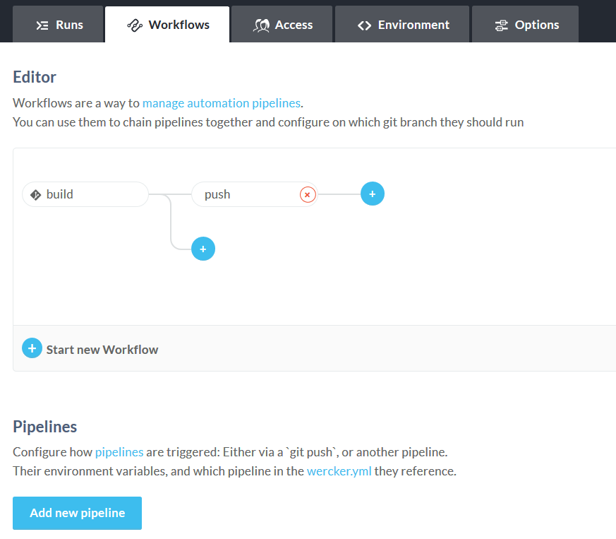
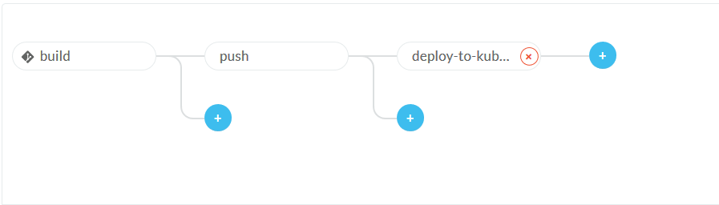

## Deploy the newly created application on the OKE cluster using Oracle Container Pipelines

In this lab we are going to create the deployment process of the application that we have created on the previous labs. In the next steps we will be creating the configuration files necessary to build our application in our Oracle Container Engine for Kubernetes cluster.

Prior to the new files we need to configure some new environment variables on our Wercker console, so lets do it:

Log in your [Wercker](app.wercker.com) using your github account


Click on the pipelines icon on the top bar


Access the cloudnativeapp and click on the and Environment tab




Add the following variables:

* OKE_MASTER
* OKE_TOKEN

To get these information, please follow de guide bellow:

In your bastion instance, create a file called oke-admin-service-account.yaml with the following content:
 ```
 apiVersion: v1
kind: ServiceAccount
metadata:
  name: oke-admin
  namespace: kube-system
---
apiVersion: rbac.authorization.k8s.io/v1beta1
kind: ClusterRoleBinding
metadata:
  name: oke-admin
roleRef:
  apiGroup: rbac.authorization.k8s.io
  kind: ClusterRole
  name: cluster-admin
subjects:
- kind: ServiceAccount
  name: oke-admin
  namespace: kube-system
 ```

_The file defines an administrator service account and a clusterrolebinding, both called oke-admin._

Create the service account and the clusterrolebinding in the cluster by entering:
```
kubectl apply -f oke-admin-service-account.yaml 
```
The output from the above command confirms the creation of the service account and the clusterrolebinding:
```
serviceaccount "oke-admin" created
clusterrolebinding.rbac.authorization.k8s.io "oke-admin" created
```

Obtain an authentication token for the oke-admin service account by entering:
```
kubectl -n kube-system describe secret $(kubectl -n kube-system get secret | grep oke-admin | awk '{print $1}')
```

Now you are ready to finish the pipeline.

In your forked repository in your github account, create a file named kubernetes_deployment.yml.template.

Copy and paste the kubernetes YAML of our application:

```
apiVersion: extensions/v1beta1
kind: Deployment
metadata:
  name: cloudnativeapp
  labels:
    commit: ${WERCKER_GIT_COMMIT}
spec:
  replicas: 1
  selector:
    matchLabels:
      app: cloudnativeapp
  template:
    metadata:
      labels:
        app: cloudnativeapp
        commit: ${WERCKER_GIT_COMMIT}
    spec:
      containers:
      - name: cloudnativeapp
        image: ${DOCKER_REGISTRY}/${DOCKER_REPO}:${WERCKER_GIT_COMMIT}
        ports:
        - name: cloudnativeapp
          containerPort: 80
          protocol: TCP
      imagePullSecrets:
        - name: wercker
---
apiVersion: v1
kind: Service
metadata:
  name: cloudnativeapp
  labels:
    app: cloudnativeapp
    commit: ${WERCKER_GIT_COMMIT}
spec:
  ports:
  - port: 80
    targetPort: 80
  selector:
    app: cloudnativeapp
    commit: ${WERCKER_GIT_COMMIT}
    type: LoadBalancer
```

Now we have to update our wercker.yml file to add the deployment step on our workflow:

```
deploy-to-kubernetes:
    box: node:current-slim
    steps:

    # https://github.com/wercker/step-bash-template
    # This Wercker step will look for files in our repo with a .template extension.
    # It will expand any environment variables in those files, then remove the
    # template extension.
    - bash-template

    # The step above should leave us with a Kubernetes service and deployment yml files.
    # We'll create a directory to move them to.
    - script:
        name: Prepare Kubernetes files
        code: |
          mkdir $WERCKER_OUTPUT_DIR/kubernetes
          mv kubernetes_*.yml $WERCKER_OUTPUT_DIR/kubernetes

    #This step cleans up the previous secret configuration
    - kubectl
        name: Delete secrets
        server: $OKE_MASTER
        token: $OKE_TOKEN
        insecure-skip-tls-verify: true
        command: kubectl delete secrets wercker; echo delete registry secret

    #Create a new secret referencing your ocir repository
    - kubectl
        name: Create a new secret
        server: $OKE_MASTER
        token: $OKE_TOKEN
        insecure-skip-tls-verify: true
        command: create secret docker-registry wercker --dockerserver=$DOCKER_REGISTRY --docker-email=nobody@noemail.com --docker-username=$DOCKER_USERNAME --docker-password='$OCI_AUTH_TOKEN'; echo create registry secret
        
    # `apply` is a good command to use here, as it'll create Kubernetes entities if they are missing.
    - kubectl:
        name: deploy to kubernetes
        server: $OKE_MASTER
        token: $OKE_TOKEN
        insecure-skip-tls-verify: true
        command: apply -f $WERCKER_OUTPUT_DIR/kubernetes/

    # Tell Kubernetes that we're going to wait 60 seconds for the deploy to be successful
    - kubectl:
        name: set deployment timeout
        server: $OKE_MASTER
        token: $OKE_TOKEN
        insecure-skip-tls-verify: true
        command: patch deployment/cloudnativeapp -p '{"spec":{"progressDeadlineSeconds":60}}'

    # Watch the Kubernetes deployment. Once the pods are considered healthy the step will exit 0
    # If they aren't healthy within 60 seconds, it will exit with a non 0 exit code, and cause the run to fail.
    - kubectl:
        name: check deployment status
        server: $OKE_MASTER
        token: $OKE_TOKEN
        insecure-skip-tls-verify: true
        command: rollout status deployment/cloudnativeapp
```

#### Almost Done

Now we just need to add the deployment step on our pipeline, back to the wercker console

On the Workflows tab, click on Add new pipeline:



Add the information bellow:

* Name: deploy-to-kubernetes
* YML pipeline name: deploy-to-kubernetes
* Hook type: Default

Click on create.

Get back to the workflows tab, and add your pipeline to your flow:



#### Now it's time to test your environment!!!!

This app is just a simple app that calls a rest endpoint, change it to test the endpoints that you have created on this workshop!

